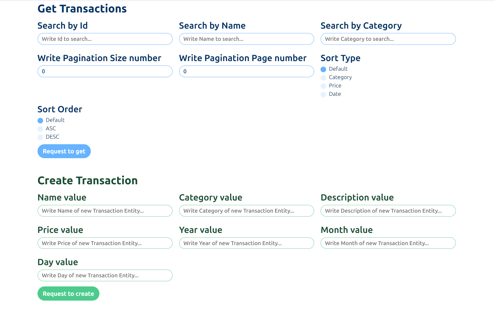

# Finance Tracker

## Overview

Finance Tracker is a full-stack web application designed to help users track and manage their financial transactions.
The application provides a user-friendly interface for creating, reading, updating, and deleting (CRUD) financial transactions with various filtering and sorting capabilities.

**<small>Client Page:</small>**


**<small>API Endpoints in Swagger:</small>**


## Technologies Used

### Backend

- ASP.NET Core
- Entity Framework Core
- PostgreSQL

### Frontend

- Vue 3
- TypeScript
- Vite
- Axios

### Others

- Docker

## Features

### Transaction Management

- Create new transactions
- View transactions with multiple filter options
- Update existing transactions
- Remove transactions
- Sort transactions by different criteria
- Paginate transaction results

## Prerequisites

Before you begin, ensure you have the following installed:

- .NET 8 SDK
- Node.js (pnpm preferred)
- Docker

## Setup and Installation

### Backend Setup

1. Clone the repository
2. Navigate to the `FinanceTracker.Api` directory
3. Configure database connection in `appsettings.Development.json`
4. Run database migrations

```shell
dotnet ef database update
```

### Frontend Setup

1. Navigate to `financetracker.client` directory
2. Install dependencies

```shell
pnpm install
```

### Docker Compose

Run Docker Compose to create the PostgreSQL database:

```shell
docker-compose up -d
```

## Running the Application

### Backend

```shell
dotnet run
```

It will start on `http://localhost:8080` by default

### Frontend

```shell
pnpm run dev
```

It will start on `http://localhost:5000` by default

# Project Structure

## Backend (`FinanceTracker.Api`)

- `Controllers/`: API endpoints
- `Models/`: Data models
- `Repositories/`: Data access logic
- `Migrations/`: Database schema migrations

## Frontend (`financetracker.client`)

- `src/pages/`: Page components
- `src/types/`: TypeScript interfaces
- `src/services/`: Service classes for API interactions
- `styles/`: CSS styling and themes

# API Endpoints

- `GET /Transactions`: Retrieve transactions
- `POST /Transactions`: Create a transaction
- `PUT /Transactions`: Update a transaction
- `DELETE /Transactions`: Remove a transaction
